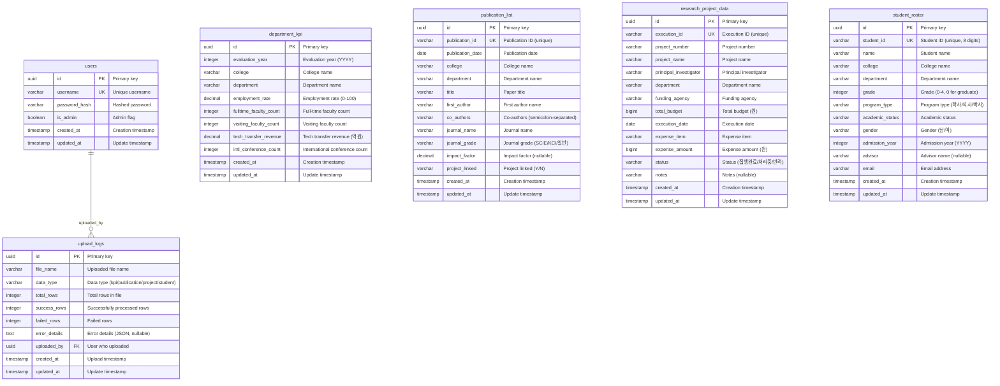

# 데이터베이스 스키마 (Database Schema)

> **중요:** 이 문서는 다음 문서들을 기반으로 작성됩니다:
> - `docs/dataflow.md`: 데이터 흐름 및 아키텍처
> - `docs/csv-sample.md`: 실제 CSV 파일 구조 명세 (필수 참조)
> - `docs/prd.md`: 제품 요구사항
>
> 특히 **`docs/csv-sample.md`**에 명시된 4개 CSV 파일(`department_kpi.csv`, `publication_list.csv`, `research_project_data.csv`, `student_roster.csv`)의 구조를 정확히 반영하여 데이터베이스 스키마를 설계했습니다.

## 1. ERD (Entity-Relationship Diagram)

> Mermaid.js 문법을 사용하여 전체 데이터베이스의 구조를 시각적으로 표현합니다.



## 2. 테이블 명세 (Table Specifications)

### 2.1. `users`
- **설명:** 시스템에 로그인할 수 있는 사용자(관리자 및 일반 사용자) 계정 정보를 저장하는 테이블입니다.

| 컬럼명 (Column Name) | 데이터 타입 (Data Type) | 제약 조건 (Constraints) | 설명 (Description) |
|---|---|---|---|
| `id` | `UUID` | `PK`, `DEFAULT gen_random_uuid()` | 고유 식별자 |
| `username` | `VARCHAR(150)` | `NOT NULL`, `UNIQUE` | 로그인 시 사용할 아이디 |
| `password_hash` | `VARCHAR(255)` | `NOT NULL` | 해시(Hash) 처리된 비밀번호 (bcrypt) |
| `is_admin` | `BOOLEAN` | `NOT NULL`, `DEFAULT false` | 관리자 권한 여부 |
| `created_at` | `TIMESTAMP` | `NOT NULL`, `DEFAULT NOW()` | 생성 일시 |
| `updated_at` | `TIMESTAMP` | `NOT NULL`, `DEFAULT NOW()` | 마지막 수정 일시 |

**인덱스:**
- `idx_users_username`: `username` 컬럼에 UNIQUE 인덱스

### 2.2. `department_kpi`
- **설명:** 학과별 연도별 주요 성과 지표(KPI) 데이터를 저장하는 테이블입니다. `department_kpi.csv` 파일과 대응됩니다.

| 컬럼명 (Column Name) | 데이터 타입 (Data Type) | 제약 조건 (Constraints) | 설명 (Description) |
|---|---|---|---|
| `id` | `UUID` | `PK`, `DEFAULT gen_random_uuid()` | 고유 식별자 |
| `evaluation_year` | `INTEGER` | `NOT NULL`, `CHECK (evaluation_year >= 2023 AND evaluation_year <= 2025)` | 평가년도 (2023~2025) |
| `college` | `VARCHAR(50)` | `NOT NULL` | 단과대학명 (예: 공과대학, 인문대학) |
| `department` | `VARCHAR(50)` | `NOT NULL` | 학과명 (예: 컴퓨터공학과) |
| `employment_rate` | `DECIMAL(5,2)` | `NOT NULL`, `CHECK (employment_rate >= 0 AND employment_rate <= 100)` | 졸업생 취업률 (%) (0~100 범위) |
| `fulltime_faculty_count` | `INTEGER` | `NOT NULL`, `CHECK (fulltime_faculty_count >= 0)` | 전임교원 수 (명) (0 이상) |
| `visiting_faculty_count` | `INTEGER` | `NOT NULL`, `CHECK (visiting_faculty_count >= 0)` | 초빙교원 수 (명) (0 이상) |
| `tech_transfer_revenue` | `DECIMAL(10,2)` | `NOT NULL`, `CHECK (tech_transfer_revenue >= 0)` | 연간 기술이전 수입액 (억원) (0 이상, 소수점 2자리) |
| `intl_conference_count` | `INTEGER` | `NOT NULL`, `CHECK (intl_conference_count >= 0)` | 국제학술대회 개최 횟수 (0 이상) |
| `created_at` | `TIMESTAMP` | `NOT NULL`, `DEFAULT NOW()` | 생성 일시 |
| `updated_at` | `TIMESTAMP` | `NOT NULL`, `DEFAULT NOW()` | 마지막 수정 일시 |

**Primary Key:** `(evaluation_year, department)` - 복합키 (CSV 파일의 Primary Key와 동일)

**인덱스:**
- `idx_department_kpi_year_dept`: `(evaluation_year, department)` 복합 UNIQUE 인덱스
- `idx_department_kpi_college`: `college` 컬럼에 인덱스 (학과별 조회 성능)
- `idx_department_kpi_department`: `department` 컬럼에 인덱스

### 2.3. `publication_list`
- **설명:** 학과별 논문 게재 현황 데이터를 저장하는 테이블입니다. `publication_list.csv` 파일과 대응됩니다.

| 컬럼명 (Column Name) | 데이터 타입 (Data Type) | 제약 조건 (Constraints) | 설명 (Description) |
|---|---|---|---|
| `id` | `UUID` | `PK`, `DEFAULT gen_random_uuid()` | 고유 식별자 |
| `publication_id` | `VARCHAR(20)` | `NOT NULL`, `UNIQUE` | 논문ID (고유 식별자, 예: PUB-23-001) |
| `publication_date` | `DATE` | `NOT NULL` | 게재일 (YYYY-MM-DD) |
| `college` | `VARCHAR(50)` | `NOT NULL` | 단과대학명 |
| `department` | `VARCHAR(50)` | `NOT NULL` | 학과명 |
| `title` | `VARCHAR(500)` | `NOT NULL` | 논문제목 (한글 또는 영문) |
| `first_author` | `VARCHAR(100)` | `NOT NULL` | 주저자명 |
| `co_authors` | `VARCHAR(500)` | `NULL` | 참여저자 (세미콜론(;)으로 구분, 선택) |
| `journal_name` | `VARCHAR(200)` | `NOT NULL` | 학술지명 |
| `journal_grade` | `VARCHAR(20)` | `NOT NULL`, `CHECK (journal_grade IN ('SCIE', 'KCI', '일반'))` | 저널등급 (SCIE, KCI, 일반) |
| `impact_factor` | `DECIMAL(5,2)` | `NULL` | Impact Factor (SCIE 논문만 해당, 선택) |
| `project_linked` | `VARCHAR(1)` | `NOT NULL`, `CHECK (project_linked IN ('Y', 'N'))` | 과제연계여부 (Y 또는 N) |
| `created_at` | `TIMESTAMP` | `NOT NULL`, `DEFAULT NOW()` | 생성 일시 |
| `updated_at` | `TIMESTAMP` | `NOT NULL`, `DEFAULT NOW()` | 마지막 수정 일시 |

**Primary Key:** `publication_id` (단일키)

**인덱스:**
- `idx_publication_list_pub_id`: `publication_id` 컬럼에 UNIQUE 인덱스
- `idx_publication_list_date`: `publication_date` 컬럼에 인덱스 (날짜별 조회 성능)
- `idx_publication_list_college_dept`: `(college, department)` 복합 인덱스
- `idx_publication_list_journal_grade`: `journal_grade` 컬럼에 인덱스 (저널 등급별 필터링)

### 2.4. `research_project_data`
- **설명:** 연구과제별 예산 집행 내역 데이터를 저장하는 테이블입니다. `research_project_data.csv` 파일과 대응됩니다.

| 컬럼명 (Column Name) | 데이터 타입 (Data Type) | 제약 조건 (Constraints) | 설명 (Description) |
|---|---|---|---|
| `id` | `UUID` | `PK`, `DEFAULT gen_random_uuid()` | 고유 식별자 |
| `execution_id` | `VARCHAR(20)` | `NOT NULL`, `UNIQUE` | 집행ID (고유 식별자, 예: T2301001) |
| `project_number` | `VARCHAR(50)` | `NOT NULL` | 과제번호 (예: NRF-2023-015) |
| `project_name` | `VARCHAR(200)` | `NOT NULL` | 과제명 |
| `principal_investigator` | `VARCHAR(100)` | `NOT NULL` | 연구책임자 (교수명) |
| `department` | `VARCHAR(50)` | `NOT NULL` | 소속학과 |
| `funding_agency` | `VARCHAR(100)` | `NOT NULL` | 지원기관 (예: 한국연구재단) |
| `total_budget` | `BIGINT` | `NOT NULL`, `CHECK (total_budget >= 0)` | 총연구비 (원) (0 이상) |
| `execution_date` | `DATE` | `NOT NULL` | 집행일자 (YYYY-MM-DD) |
| `expense_item` | `VARCHAR(100)` | `NOT NULL` | 집행항목 (예: 연구장비 도입) |
| `expense_amount` | `BIGINT` | `NOT NULL`, `CHECK (expense_amount >= 0)` | 집행금액 (원) (0 이상) |
| `status` | `VARCHAR(20)` | `NOT NULL`, `CHECK (status IN ('집행완료', '처리중', '반려'))` | 상태 (집행완료, 처리중, 반려) |
| `notes` | `VARCHAR(500)` | `NULL` | 비고 (추가 설명, 선택) |
| `created_at` | `TIMESTAMP` | `NOT NULL`, `DEFAULT NOW()` | 생성 일시 |
| `updated_at` | `TIMESTAMP` | `NOT NULL`, `DEFAULT NOW()` | 마지막 수정 일시 |

**Primary Key:** `execution_id` (단일키)

**인덱스:**
- `idx_research_project_exec_id`: `execution_id` 컬럼에 UNIQUE 인덱스
- `idx_research_project_number`: `project_number` 컬럼에 인덱스 (과제번호별 집계)
- `idx_research_project_dept`: `department` 컬럼에 인덱스
- `idx_research_project_date`: `execution_date` 컬럼에 인덱스 (날짜별 조회)
- `idx_research_project_status`: `status` 컬럼에 인덱스 (상태별 필터링)

**비고:** 집행금액의 합계가 총연구비를 초과하는 경우는 애플리케이션 레벨에서 검증 (과제번호별 집계)

### 2.5. `student_roster`
- **설명:** 학부생 및 대학원생의 기본 정보를 저장하는 테이블입니다. `student_roster.csv` 파일과 대응됩니다.

| 컬럼명 (Column Name) | 데이터 타입 (Data Type) | 제약 조건 (Constraints) | 설명 (Description) |
|---|---|---|---|
| `id` | `UUID` | `PK`, `DEFAULT gen_random_uuid()` | 고유 식별자 |
| `student_id` | `VARCHAR(10)` | `NOT NULL`, `UNIQUE` | 학번 (고유 식별자, 8자리) |
| `name` | `VARCHAR(50)` | `NOT NULL` | 이름 |
| `college` | `VARCHAR(50)` | `NOT NULL` | 단과대학명 |
| `department` | `VARCHAR(50)` | `NOT NULL` | 학과명 |
| `grade` | `INTEGER` | `NOT NULL`, `CHECK (grade >= 0 AND grade <= 4)` | 학년 (0~4, 0은 대학원생) |
| `program_type` | `VARCHAR(10)` | `NOT NULL`, `CHECK (program_type IN ('학사', '석사', '박사'))` | 과정구분 (학사, 석사, 박사) |
| `academic_status` | `VARCHAR(20)` | `NOT NULL`, `CHECK (academic_status IN ('재학', '휴학', '졸업', '제적'))` | 학적상태 (재학, 휴학, 졸업, 제적) |
| `gender` | `VARCHAR(1)` | `NOT NULL`, `CHECK (gender IN ('남', '여'))` | 성별 (남, 여) |
| `admission_year` | `INTEGER` | `NOT NULL`, `CHECK (admission_year >= 2000 AND admission_year <= 2100)` | 입학년도 (YYYY, 4자리) |
| `advisor` | `VARCHAR(50)` | `NULL` | 지도교수 (대학원생의 경우 필수, 학부생은 선택) |
| `email` | `VARCHAR(100)` | `NOT NULL` | 이메일 주소 (이메일 형식 검증) |
| `created_at` | `TIMESTAMP` | `NOT NULL`, `DEFAULT NOW()` | 생성 일시 |
| `updated_at` | `TIMESTAMP` | `NOT NULL`, `DEFAULT NOW()` | 마지막 수정 일시 |

**Primary Key:** `student_id` (단일키)

**인덱스:**
- `idx_student_roster_student_id`: `student_id` 컬럼에 UNIQUE 인덱스
- `idx_student_roster_college_dept`: `(college, department)` 복합 인덱스
- `idx_student_roster_program_type`: `program_type` 컬럼에 인덱스 (과정별 통계)
- `idx_student_roster_academic_status`: `academic_status` 컬럼에 인덱스 (학적상태별 통계)
- `idx_student_roster_email`: `email` 컬럼에 인덱스 (이메일 검색)

**비고:** 
- 학년이 0인 경우 과정구분은 '석사' 또는 '박사'여야 함 (애플리케이션 레벨 검증)
- 과정구분이 '석사' 또는 '박사'인 경우 지도교수는 필수 (애플리케이션 레벨 검증)

### 2.6. `upload_logs`
- **설명:** CSV 파일 업로드 이력을 저장하는 테이블입니다.

| 컬럼명 (Column Name) | 데이터 타입 (Data Type) | 제약 조건 (Constraints) | 설명 (Description) |
|---|---|---|---|
| `id` | `UUID` | `PK`, `DEFAULT gen_random_uuid()` | 고유 식별자 |
| `file_name` | `VARCHAR(255)` | `NOT NULL` | 업로드된 파일명 |
| `data_type` | `VARCHAR(20)` | `NOT NULL`, `CHECK (data_type IN ('kpi', 'publication', 'project', 'student'))` | 데이터 유형 (kpi/publication/project/student) |
| `total_rows` | `INTEGER` | `NOT NULL`, `CHECK (total_rows >= 0)` | 파일 내 전체 행 수 |
| `success_rows` | `INTEGER` | `NOT NULL`, `CHECK (success_rows >= 0)` | 성공적으로 처리된 행 수 |
| `failed_rows` | `INTEGER` | `NOT NULL`, `CHECK (failed_rows >= 0)` | 처리 실패한 행 수 |
| `error_details` | `TEXT` | `NULL` | 오류 상세 정보 (JSON 형식, 실패한 행의 상세 오류) |
| `uploaded_by` | `UUID` | `NOT NULL`, `FK -> users.id` | 업로드한 사용자 ID |
| `created_at` | `TIMESTAMP` | `NOT NULL`, `DEFAULT NOW()` | 업로드 일시 |
| `updated_at` | `TIMESTAMP` | `NOT NULL`, `DEFAULT NOW()` | 마지막 수정 일시 |

**Primary Key:** `id` (단일키)

**Foreign Keys:**
- `uploaded_by` → `users.id` (ON DELETE RESTRICT)

**인덱스:**
- `idx_upload_logs_uploaded_by`: `uploaded_by` 컬럼에 인덱스 (사용자별 이력 조회)
- `idx_upload_logs_data_type`: `data_type` 컬럼에 인덱스 (데이터 유형별 조회)
- `idx_upload_logs_created_at`: `created_at` 컬럼에 인덱스 (날짜별 정렬)

## 3. 테이블 간 관계 (Relationships)

### 3.1 Foreign Key 관계
- `upload_logs.uploaded_by` → `users.id`: 업로드 로그는 사용자와 연결됩니다.

### 3.2 논리적 관계 (Foreign Key 없음, 데이터 정합성 검증 필요)
- `publication_list.college` / `publication_list.department` → `department_kpi.college` / `department_kpi.department`: 논문의 학과가 KPI 데이터와 일치해야 함 (애플리케이션 레벨 검증)
- `publication_list.first_author` → `student_roster.name`: 논문의 주저자가 학생 명부에 있을 수 있음 (선택적 관계)
- `research_project_data.department` → `department_kpi.department`: 연구과제의 학과가 KPI 데이터와 일치해야 함 (애플리케이션 레벨 검증)
- `research_project_data.principal_investigator`: 교수 테이블이 없으므로 현재는 검증 불가

### 3.3 데이터 정합성 검증 규칙
- 학과명(`department`)과 단과대학명(`college`)이 모든 파일에서 일관되게 사용되어야 함
- 애플리케이션 레벨에서 크로스 파일 참조 검증 수행

## 4. 트리거 (Triggers)

### 4.1 `updated_at` 자동 업데이트 트리거
모든 테이블에 대해 `updated_at` 컬럼이 자동으로 업데이트되도록 트리거를 생성합니다.

```sql
CREATE OR REPLACE FUNCTION update_updated_at_column()
RETURNS TRIGGER AS $$
BEGIN
    NEW.updated_at = NOW();
    RETURN NEW;
END;
$$ LANGUAGE plpgsql;

-- 각 테이블에 트리거 적용 예시 (department_kpi)
CREATE TRIGGER update_department_kpi_updated_at
    BEFORE UPDATE ON department_kpi
    FOR EACH ROW
    EXECUTE FUNCTION update_updated_at_column();
```

(나머지 테이블에도 동일하게 적용)

## 5. RLS (Row Level Security) 설정

**중요:** 프로젝트 규칙에 따라 RLS는 비활성화합니다.
- 모든 테이블에 대해 `ALTER TABLE <table_name> DISABLE ROW LEVEL SECURITY;` 실행

## 6. 데이터 타입 선택 근거

- **UUID 사용:** PostgreSQL의 `gen_random_uuid()`를 사용하여 분산 환경에서도 안전한 고유 식별자 생성
- **VARCHAR 길이:** CSV 명세의 최대 길이를 반영
- **DECIMAL 사용:** 정확한 소수점 계산이 필요한 취업률, 기술이전 수입액, Impact Factor 등에 사용
- **BIGINT 사용:** 총연구비, 집행금액은 원 단위로 저장하므로 큰 정수 타입 필요
- **CHECK 제약조건:** 데이터 무결성을 보장하기 위해 도메인 제약 조건 추가

## 7. 인덱스 전략

### 7.1 Primary Key 인덱스
- 모든 테이블의 Primary Key는 자동으로 인덱스가 생성됩니다.

### 7.2 조회 성능 최적화 인덱스
- 필터링에 자주 사용되는 컬럼에 인덱스 생성 (college, department, journal_grade, status 등)
- 날짜 컬럼에 인덱스 생성 (publication_date, execution_date 등)
- 복합 인덱스 생성 (college + department 등)

### 7.3 정렬 성능 최적화
- `created_at`, `updated_at` 컬럼에 인덱스 생성 (최신 데이터 조회)

---

**문서 버전:** 1.0  
**작성일:** 2025-01-XX  
**작성자:** database-architect 에이전트  
**기반 문서:** `docs/dataflow.md`, `docs/prd.md`, `docs/csv-sample.md`
