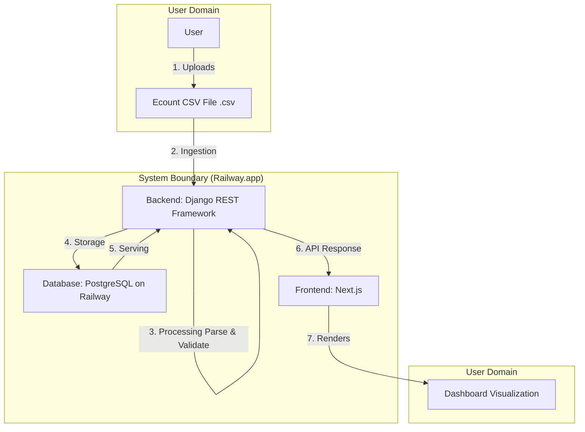

# 데이터 흐름 명세서 (Data Flow Specification)

> 이 문서는 Ecount CSV 파일이 시스템에 입력되어 사용자에게 대시보드로 시각화되기까지의 전체 데이터 파이프라인을 정의합니다.
>
> **참고:** 실제 CSV 파일 구조는 `docs/csv-sample.md`에 명세되어 있습니다. 본 문서는 데이터 처리 흐름에 초점을 맞추며, 상세한 CSV 구조 정의는 `docs/csv-sample.md`를 참조하세요.

## 1. 전체 흐름도 (Overall Flow Diagram)



## 2. 단계별 상세 설명 (Step-by-Step Description)

### 2.1. 수집 (Ingestion)

- **설명:** 사용자가 업로드한 원본 CSV 파일을 시스템이 수신하는 단계입니다.
- **원본 데이터 소스:** Ecount 시스템에서 추출한 `.csv` 파일
- **파일 종류:** 시스템은 다음 4개의 CSV 파일을 처리합니다:
  - `department_kpi.csv`: 학과별 연도별 주요 성과 지표 (KPI)
    - 컬럼: 평가년도, 단과대학, 학과, 졸업생 취업률, 전임교원 수, 초빙교원 수, 연간 기술이전 수입액, 국제학술대회 개최 횟수
  - `publication_list.csv`: 논문 게재 현황
    - 컬럼: 논문ID, 게재일, 단과대학, 학과, 논문제목, 주저자, 참여저자, 학술지명, 저널등급, Impact Factor, 과제연계여부
  - `research_project_data.csv`: 연구과제 예산 집행 데이터
    - 컬럼: 집행ID, 과제번호, 과제명, 연구책임자, 소속학과, 지원기관, 총연구비, 집행일자, 집행항목, 집행금액, 상태, 비고
  - `student_roster.csv`: 학생 명부 (학부생, 대학원생)
    - 컬럼: 학번, 이름, 단과대학, 학과, 학년, 과정구분, 학적상태, 성별, 입학년도, 지도교수, 이메일
- **데이터 구조:** 각 CSV 파일의 상세 구조는 `docs/csv-sample.md`에 명세되어 있습니다. (컬럼명, 데이터 타입, 필수 여부, 제약 조건 등)
- **파일 형식 규칙:**
  - 인코딩: UTF-8 with BOM (한글 포함)
  - 구분자: 쉼표 (`,`)
  - 헤더 행: 1행 (컬럼명)
  - 데이터 시작 행: 2행

### 2.2. 처리 (Processing)

- **설명:** 수집된 원본 데이터를 정제하고, 유효성을 검사하여 데이터베이스에 저장할 수 있는 형태로 가공하는 단계입니다.
- **파싱 로직:**
  - 백엔드(Python/Django)에서 Pandas를 사용하여 CSV 파일을 파싱합니다.
  - UTF-8 with BOM 인코딩을 지원하여 한글 데이터를 올바르게 처리합니다.
  - Pandas `read_csv()` 함수를 사용하여 각 CSV 파일의 헤더 행을 자동으로 인식하고 데이터 행을 읽어들입니다.
  - 파일 유형(데이터 유형)을 사용자가 선택한 값에 따라 적절한 파싱 로직을 적용합니다.
- **데이터 변환:**
  - 날짜 형식 컬럼(`게재일`, `집행일자`, `입학년도` 등)을 표준 날짜 타입(YYYY-MM-DD)으로 변환합니다.
    - 허용 형식: `YYYY-MM-DD`, `YYYY.MM.DD`, `YYYY/MM/DD`
    - 변환 후 모두 `YYYY-MM-DD` 형식으로 통일
  - 각 수치 데이터의 불필요한 공백이나 문자를 제거하고 숫자 타입으로 변환합니다.
    - 정수 컬럼: `전임교원 수`, `초빙교원 수`, `국제학술대회 개최 횟수`, `총연구비`, `집행금액`, `학년`, `입학년도` 등
    - 소수 컬럼: `졸업생 취업률`, `연간 기술이전 수입액`, `Impact Factor` 등
  - 문자열 데이터는 앞뒤 공백을 제거합니다 (`trim()`).
  - Enum 값은 대소문자 구분 없이 처리하고 대문자로 변환합니다 (예: `'scie'` → `'SCIE'`, `'y'` → `'Y'`).
- **유효성 검증:**
  - Zod 스키마를 사용하여 각 행의 데이터 유효성을 검증합니다.
  - `docs/csv-sample.md`에 명시된 실제 CSV 구조와 제약 조건을 기반으로 검증 규칙을 정의합니다.
  - 각 파일별 검증 규칙:
    - **department_kpi.csv:**
      - 필수 컬럼: 평가년도, 단과대학, 학과, 졸업생 취업률, 전임교원 수, 초빙교원 수, 연간 기술이전 수입액, 국제학술대회 개최 횟수
      - 평가년도 범위: 2023~2025
      - 취업률 범위: 0~100
      - 전임교원 수, 초빙교원 수, 국제학술대회 개최 횟수: 0 이상
      - 기술이전 수입액: 0 이상 (억원 단위)
      - Primary Key: (평가년도, 학과) - 중복 검사
    - **publication_list.csv:**
      - 필수 컬럼: 논문ID, 게재일, 단과대학, 학과, 논문제목, 주저자, 학술지명, 저널등급, 과제연계여부
      - 논문ID: 고유 식별자 (중복 검사)
      - 저널등급: 'SCIE', 'KCI', '일반' 중 하나
      - Impact Factor: SCIE 논문인 경우 필수, 그 외 선택
      - 과제연계여부: 'Y' 또는 'N'
      - 참여저자: 세미콜론(;)으로 구분된 문자열 (선택)
    - **research_project_data.csv:**
      - 필수 컬럼: 집행ID, 과제번호, 과제명, 연구책임자, 소속학과, 지원기관, 총연구비, 집행일자, 집행항목, 집행금액, 상태
      - 집행ID: 고유 식별자 (중복 검사)
      - 상태: '집행완료', '처리중', '반려' 중 하나
      - 집행금액: 0 이상, 총연구비 이하 (과제번호별 집계 검증)
      - 비고: 선택 컬럼
    - **student_roster.csv:**
      - 필수 컬럼: 학번, 이름, 단과대학, 학과, 학년, 과정구분, 학적상태, 성별, 입학년도, 이메일
      - 학번: 고유 식별자 (8자리, 중복 검사)
      - 학년: 0~4 (0은 대학원생)
      - 과정구분: '학사', '석사', '박사' 중 하나
      - 학적상태: '재학', '휴학', '졸업', '제적' 중 하나
      - 성별: '남', '여'
      - 이메일: 유효한 이메일 형식 검증
      - 지도교수: 과정구분이 '석사' 또는 '박사'인 경우 필수, 그 외 선택
  - 검증 실패한 행은 오류 정보를 수집하고, 유효한 행만 다음 단계로 진행합니다.
- **오류 처리:**
  - 유효성 검증에 실패한 행은 Django 로깅 시스템을 통해 로그를 남기고, 해당 행을 제외한 나머지 데이터만 처리합니다.
  - 파일 전체를 거부하지 않고, 처리 가능한 행만 데이터베이스에 저장합니다 (부분 실패 허용).
  - Django ORM의 `bulk_create()` 또는 `bulk_update()`를 사용하여 효율적으로 데이터를 저장합니다.
  - 처리 결과(성공 행 수, 실패 행 수, 실패한 행의 상세 오류 정보)를 Django REST Framework 응답에 포함하여 사용자에게 피드백을 제공합니다.

### 2.3. 저장 (Storage)

- **설명:** 처리된 데이터를 영구적으로 보관하기 위해 데이터베이스에 저장하는 단계입니다.
- **대상 데이터베이스:** PostgreSQL (Railway)
- **저장 방식:**
  - Django ORM을 사용하여 데이터베이스에 접근합니다.
  - Django ORM의 `bulk_create()` 또는 `bulk_update()`를 사용하여 성능을 최적화합니다.
  - Django의 트랜잭션(`transaction.atomic()`)을 사용하여 데이터 일관성을 보장합니다.
- **데이터 모델링 개념:**
  - CSV 파일별로 대응하는 데이터베이스 테이블이 존재합니다:
    - `department_kpi`: 학과별 KPI 데이터
    - `publication_list`: 논문 게재 현황
    - `research_project_data`: 연구과제 예산 집행 데이터
    - `student_roster`: 학생 명부
    - `upload_logs`: 업로드 이력 (파일명, 데이터 유형, 업로드 일시, 성공/실패 행 수 등)
  - 각 테이블은 `docs/database.md`에 정의된 스키마를 따릅니다. 스키마는 `docs/csv-sample.md`의 실제 CSV 구조를 반영하여 설계됩니다.
  - Primary Key 중복 시 `upsert` 전략을 사용하여 기존 데이터를 업데이트하거나 새로 삽입합니다. (Primary Key 정의는 `docs/csv-sample.md`의 "파일 간 관계" 섹션 참조)
    - `department_kpi`: (evaluation_year, department) 복합키
    - `publication_list`: publication_id (단일키)
    - `research_project_data`: execution_id (단일키)
    - `student_roster`: student_id (단일키)
  - 모든 테이블에 `created_at`, `updated_at` 컬럼을 자동으로 관리합니다 (트리거 사용).

### 2.4. 제공 (Serving)

- **설명:** 저장된 데이터를 프론트엔드의 요청에 따라 API를 통해 제공하는 단계입니다.
- **API 제공 형태:**
  - 프론트엔드의 시각화 라이브러리(Recharts)가 직접 사용할 수 있는 JSON 배열 형태로 데이터를 가공하여 제공합니다.
  - 예시 (`GET /api/dashboard/performance`):
    ```json
    {
      "employment_rates": [
        { "department": "컴퓨터공학과", "college": "공과대학", "employment_rate": 85.5, "evaluation_year": 2023 },
        { "department": "전자공학과", "college": "공과대학", "employment_rate": 88.2, "evaluation_year": 2023 }
      ],
      "tech_transfer_revenue": [
        { "evaluation_year": 2023, "department": "컴퓨터공학과", "revenue": 8.5 },
        { "evaluation_year": 2024, "department": "컴퓨터공학과", "revenue": 10.2 }
      ],
      "faculty_status": [
        { "department": "컴퓨터공학과", "fulltime_count": 15, "visiting_count": 4 }
      ]
    }
    ```
- **데이터 가공:**
  - 프론트엔드의 부담을 줄이기 위해, 기간별 집계(Aggregation), 그룹화, 정렬은 백엔드에서 미리 처리하여 API 응답에 포함합니다.
  - 필터링(연도, 월, 부서 등)은 쿼리 파라미터로 받아서 서버 측에서 처리합니다.
  - 각 대시보드 페이지에 필요한 데이터 형식으로 변환합니다:
    - 실적 대시보드: 학과별 취업률, 기술이전 수입 추이, 교원 현황 등
    - 논문 대시보드: 저널 등급별 분포, 학과별 논문 현황 등
    - 학생 대시보드: 학과별 학생 수, 과정별 분포, 학적상태 통계 등
    - 예산 대시보드: 연구비 집행 현황, 지원기관별 분포, 과제별 집행률 등
- **캐싱 전략:**
  - React Query를 사용하여 클라이언트 측에서 데이터 캐싱을 관리합니다.
  - `staleTime`을 설정하여 일정 시간 동안 캐시된 데이터를 재사용합니다.
  - 데이터 업로드 후 관련 캐시를 무효화하여 최신 데이터를 표시합니다.

## 3. 잠재적 오류 지점 (Potential Error Points)

### 3.1 수집 단계
- 파일 형식 불일치: `.csv`가 아닌 파일 업로드 시도
- 파일 인코딩 문제: UTF-8이 아닌 인코딩으로 인한 한글 깨짐
- 파일 크기 초과: 허용된 최대 크기(예: 10MB)를 초과하는 파일
- 네트워크 오류: 업로드 중 연결 끊김

### 3.2 처리 단계
- 헤더 컬럼명 불일치: `docs/csv-sample.md`에 명시된 컬럼명과 실제 CSV 파일의 컬럼명이 일치하지 않음
- 필수 컬럼 누락: 필수 컬럼이 CSV 파일에 없는 경우
- 데이터 타입 불일치: 숫자 컬럼에 문자열 입력, 날짜 형식 오류 등
- 유효성 검증 실패: 범위 초과, Enum 값 불일치, Primary Key 중복 등
- 메모리 부족: 대용량 CSV 파일 처리 시 메모리 부족

### 3.3 저장 단계
- 데이터베이스 연결 실패: PostgreSQL 연결 오류 (Django DB 연결 실패)
- 트랜잭션 충돌: 동시 업로드 시 동일 데이터에 대한 트랜잭션 충돌
- 제약 조건 위반: 외래 키 제약 조건 위반, NOT NULL 제약 위반 등

### 3.4 제공 단계
- 데이터 없음: 요청한 필터 조건에 해당하는 데이터가 없는 경우
- 쿼리 성능 저하: 복잡한 집계 쿼리로 인한 응답 시간 지연
- API 인증 실패: JWT 토큰 만료 또는 유효하지 않음

## 4. 데이터 변환 매핑 (Data Transformation Mapping)

### 4.1 department_kpi.csv → database
- 평가년도 → `evaluation_year` (INTEGER)
- 단과대학 → `college` (VARCHAR(50))
- 학과 → `department` (VARCHAR(50))
- 졸업생 취업률 (%) → `employment_rate` (DECIMAL(5,2))
- 전임교원 수 (명) → `fulltime_faculty_count` (INTEGER)
- 초빙교원 수 (명) → `visiting_faculty_count` (INTEGER)
- 연간 기술이전 수입액 (억원) → `tech_transfer_revenue` (DECIMAL(10,2))
- 국제학술대회 개최 횟수 → `intl_conference_count` (INTEGER)

### 4.2 publication_list.csv → database
- 논문ID → `publication_id` (VARCHAR(20), PK)
- 게재일 → `publication_date` (DATE)
- 단과대학 → `college` (VARCHAR(50))
- 학과 → `department` (VARCHAR(50))
- 논문제목 → `title` (VARCHAR(500))
- 주저자 → `first_author` (VARCHAR(100))
- 참여저자 → `co_authors` (VARCHAR(500), nullable)
- 학술지명 → `journal_name` (VARCHAR(200))
- 저널등급 → `journal_grade` (ENUM: 'SCIE', 'KCI', '일반')
- Impact Factor → `impact_factor` (DECIMAL(5,2), nullable)
- 과제연계여부 → `project_linked` (ENUM: 'Y', 'N')

### 4.3 research_project_data.csv → database
- 집행ID → `execution_id` (VARCHAR(20), PK)
- 과제번호 → `project_number` (VARCHAR(50))
- 과제명 → `project_name` (VARCHAR(200))
- 연구책임자 → `principal_investigator` (VARCHAR(100))
- 소속학과 → `department` (VARCHAR(50))
- 지원기관 → `funding_agency` (VARCHAR(100))
- 총연구비 → `total_budget` (INTEGER)
- 집행일자 → `execution_date` (DATE)
- 집행항목 → `expense_item` (VARCHAR(100))
- 집행금액 → `expense_amount` (INTEGER)
- 상태 → `status` (ENUM: '집행완료', '처리중', '반려')
- 비고 → `notes` (VARCHAR(500), nullable)

### 4.4 student_roster.csv → database
- 학번 → `student_id` (VARCHAR(10), PK)
- 이름 → `name` (VARCHAR(50))
- 단과대학 → `college` (VARCHAR(50))
- 학과 → `department` (VARCHAR(50))
- 학년 → `grade` (INTEGER)
- 과정구분 → `program_type` (ENUM: '학사', '석사', '박사')
- 학적상태 → `academic_status` (ENUM: '재학', '휴학', '졸업', '제적')
- 성별 → `gender` (ENUM: '남', '여')
- 입학년도 → `admission_year` (INTEGER)
- 지도교수 → `advisor` (VARCHAR(50), nullable)
- 이메일 → `email` (VARCHAR(100))

---

**문서 버전:** 1.0  
**작성일:** 2025-01-XX  
**작성자:** dataflow-analyst 에이전트  
**기반 문서:** `docs/requirement.md`, `docs/prd.md`, `docs/csv-sample.md`
