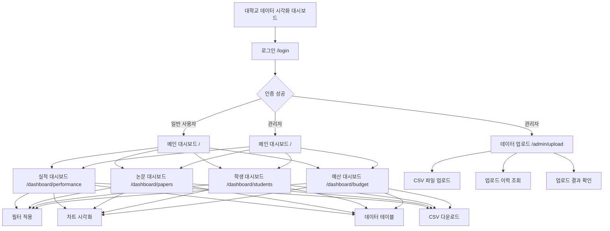

# 제품 요구사항 명세서 (Product Requirements Document)

## 1. 제품 개요 (Overview)

- **제품명:** 대학교 내부 데이터 시각화 대시보드
- **제품 목표:** Ecount 시스템에서 추출한 CSV 데이터를 기반으로, 주요 성과 지표(실적, 논문, 학생 수, 예산 등)를 직관적으로 파악할 수 있는 웹 대시보드를 구축하여, 데이터 기반 정보를 시각적으로 쉽고 편리하게 확인하여 신속하고 정확한 의사결정을 지원한다.
- **주요 사용자:** 대학교 내부 임직원 (IT 비전문가 포함)
- **핵심 가치:** 수동 데이터 취합 및 보고 과정을 자동화하여 업무 효율을 개선하고, 데이터 기반의 신속한 의사결정을 지원한다.

## 2. Stakeholders (이해관계자)

### 2.1 주요 Stakeholders
- **최종 사용자:** 대학교 내부 임직원 (학과 담당자, 행정직원, 관리자)
  - 특징: IT 비전문가 포함, 직관적인 UI/UX 필요
- **시스템 관리자:** 데이터 업로드 및 시스템 관리 권한을 가진 관리자
- **의사결정권자:** 대학교 관리층 (데이터 기반 의사결정 필요)

### 2.2 Stakeholder 요구사항 요약
- **사용자:** 직관적이고 사용하기 쉬운 인터페이스로 빠르게 지표 확인
- **관리자:** CSV 파일 업로드만으로 자동화된 데이터 처리 및 시각화
- **의사결정권자:** 주요 성과 지표를 한눈에 파악할 수 있는 대시보드

## 3. 포함 페이지 (Included Pages)

### 3.1 인증 페이지
- **`/login`** - 로그인 페이지
  - 아이디/비밀번호 기반 인증
  - 허가된 사용자만 접근 가능

### 3.2 대시보드 페이지
- **`/`** 또는 **`/dashboard`** - 메인 대시보드 (Overview)
  - 4개 주요 지표 요약 카드 (실적, 논문, 학생, 예산)
  - 각 지표별 간단한 차트 미리보기
  
- **`/dashboard/performance`** - 실적 대시보드
  - 학과별 연도별 주요 성과 지표 (KPI)
  - 취업률, 교원 수, 기술이전 수입액, 국제학술대회 개최 횟수 등

- **`/dashboard/papers`** - 논문 게재 현황 대시보드
  - 학과별/저널등급별 논문 게재 현황
  - SCIE, KCI, 일반 저널 등급별 통계

- **`/dashboard/students`** - 학생 현황 대시보드
  - 학과별/학년별/과정구분별 학생 수
  - 학적상태 통계

- **`/dashboard/budget`** - 예산 집행 대시보드
  - 연구과제별 예산 집행 내역 및 집행률
  - 지원기관별 분포, 과제별 집행 현황

### 3.3 관리자 페이지
- **`/admin/upload`** - 데이터 업로드 페이지 (관리자 전용)
  - CSV 파일 업로드 (4개 유형: 학과 KPI, 논문, 연구과제, 학생 명부)
  - 업로드 이력 조회
  - 업로드 결과 및 오류 정보 확인

## 4. 사용자 여정 (User Journey)

### 4.1 타겟 유저 세그먼트 (User Segments)

#### 세그먼트 1: 관리자 (Admin)
- **역할:** 데이터 업로드 및 시스템 관리
- **특성:** 시스템의 모든 기능에 접근 가능, CSV 파일 업로드 권한 보유
- **목표:** Ecount에서 추출한 CSV 데이터를 시스템에 업로드하여 최신 데이터를 반영

#### 세그먼트 2: 일반 사용자 (Viewer)
- **역할:** 데이터 조회 및 시각화 확인
- **특성:** IT 비전문가 포함, 직관적인 UI 필요
- **목표:** 주요 성과 지표를 시각적으로 확인하여 데이터 기반 의사결정 지원

### 4.2 주요 사용자 여정 (User Journeys)

#### 여정 1: 관리자의 데이터 업로드 여정
1. **시작:** 로그인 페이지 (`/login`)
   - 관리자 계정으로 로그인
2. **업로드:** 데이터 업로드 페이지 (`/admin/upload`)
   - Ecount에서 다운로드한 CSV 파일 선택 (4개 유형 중 선택)
   - 파일 업로드 실행
   - 업로드 결과 확인 (성공/실패 행 수, 오류 상세 정보)
3. **확인:** 메인 대시보드 (`/`)
   - 업로드된 데이터가 대시보드에 반영되었는지 확인

#### 여정 2: 일반 사용자의 대시보드 조회 여정
1. **시작:** 로그인 페이지 (`/login`)
   - 허가된 계정으로 로그인
2. **개요 확인:** 메인 대시보드 (`/`)
   - 4개 주요 지표 카드로 전체 현황 파악
3. **상세 조회:** 특정 지표 대시보드 (예: `/dashboard/performance`)
   - 필터 적용 (연도, 월, 부서 등)
   - 다양한 차트로 상세 분석
   - 데이터 테이블로 원본 데이터 확인
4. **다운로드:** 필요시 CSV 다운로드
   - 필터링된 데이터를 CSV로 내보내기

#### 여정 3: 의사결정권자의 빠른 현황 파악 여정
1. **시작:** 로그인 페이지 (`/login`)
2. **빠른 확인:** 메인 대시보드 (`/`)
   - 4개 주요 지표 카드로 핵심 지표만 신속하게 확인
   - 필요시 특정 대시보드로 이동하여 상세 분석

## 5. 정보 구조 (Information Architecture - IA)

## 6. 사용자 스토리 (User Stories)

### US-001: 사용자 로그인
- **As a** 관리자 또는 일반 사용자
- **I want to** 아이디와 비밀번호로 로그인할 수 있다
- **So that** 허가된 사용자만 시스템에 접근할 수 있다

### US-002: 데이터 업로드
- **As a** 관리자
- **I want to** Ecount에서 다운로드한 CSV 파일을 업로드할 수 있다
- **So that** 시스템이 4개 유형의 데이터(학과 KPI, 논문, 연구과제, 학생 명부)를 분석할 수 있다

### US-003: 메인 대시보드 조회
- **As a** 일반 사용자 또는 관리자
- **I want to** 주요 지표가 시각화된 메인 대시보드를 볼 수 있다
- **So that** 전체 현황을 한눈에 파악하고 빠르게 의사결정을 할 수 있다

### US-004: 실적 대시보드 조회
- **As a** 일반 사용자 또는 관리자
- **I want to** 학과별 연도별 주요 성과 지표(취업률, 교원 수, 기술이전 수입액, 국제학술대회 개최 횟수 등)를 조회할 수 있다
- **So that** 각 학과의 성과를 비교하고 평가할 수 있다

### US-005: 논문 게재 현황 조회
- **As a** 일반 사용자 또는 관리자
- **I want to** 학과별/저널등급별 논문 게재 현황을 조회할 수 있다
- **So that** 연구 실적을 파악하고 SCIE, KCI 등 저널 등급별 현황을 확인할 수 있다

### US-006: 학생 현황 조회
- **As a** 일반 사용자 또는 관리자
- **I want to** 학과별/학년별/과정구분별 학생 수와 학적상태 통계를 조회할 수 있다
- **So that** 학생 현황을 파악하고 학과별 규모를 비교할 수 있다

### US-007: 예산 집행 내역 조회
- **As a** 일반 사용자 또는 관리자
- **I want to** 연구과제별 예산 집행 내역 및 집행률을 조회할 수 있다
- **So that** 연구비 사용 현황을 모니터링하고 예산 관리가 적절히 이루어지는지 확인할 수 있다

### US-008: 필터 적용
- **As a** 일반 사용자 또는 관리자
- **I want to** 대시보드에서 연도, 월, 부서 등으로 필터를 적용할 수 있다
- **So that** 원하는 조건의 데이터만 선택적으로 확인할 수 있다

### US-009: 데이터 다운로드
- **As a** 일반 사용자 또는 관리자
- **I want to** 필터링된 데이터를 CSV 파일로 다운로드할 수 있다
- **So that** 추가 분석이나 보고서 작성에 활용할 수 있다

## 7. 핵심 기능 목록 (Feature List)

### F-01: 사용자 인증
- 아이디/비밀번호 입력 폼
- 로그인 요청 처리 및 JWT 토큰 발급
- 자동 로그인 (토큰 기반 세션 유지)
- 로그아웃 기능

### F-02: CSV 파일 업로드
- 파일 선택/드래그앤드롭 UI (4개 파일 유형 지원: 학과 KPI, 논문, 연구과제, 학생 명부)
- 파일 형식 유효성 검사 (클라이언트 사이드)
- 파일 크기 제한 검증
- 파일 전송 API (multipart/form-data)

### F-03: 데이터 파싱 및 저장
- 업로드된 CSV 데이터 파싱 로직 (4개 파일 유형별 파싱 처리)
- 파싱된 데이터 유효성 검사 (서버 사이드, 각 파일별 수십 개 컬럼에 대한 복잡한 검증 규칙)
- DB에 데이터 저장 (각 파일별 테이블 구조 반영)
- 중복 데이터 처리 (update_or_create)
- 부분 실패 처리 (유효한 행만 저장, 실패 행 오류 정보 제공)

### F-04: 메인 대시보드 시각화
- 4개 주요 지표 카드 (실적, 논문, 학생, 예산)
- 각 카드에 간단한 차트 미리보기
- 카드 클릭 시 상세 대시보드로 이동

### F-05: 실적 대시보드 조회 기능
- 학과별/연도별 필터링 기능
- 취업률, 교원 수, 기술이전 수입액, 국제학술대회 개최 횟수 등 지표 조회 API
- 비교 차트 시각화 (학과 간 비교, 연도별 추이)
- 데이터 테이블 및 CSV 다운로드

### F-06: 논문 게재 현황 조회 기능
- 학과별/저널등급별 필터링 기능
- SCIE, KCI, 일반 저널 분류별 통계 조회 API
- 논문 목록 및 통계 차트 시각화
- 데이터 테이블 및 CSV 다운로드

### F-07: 학생 현황 조회 기능
- 학과별/학년별/과정구분별 필터링 기능
- 학적상태 통계 조회 API
- 학생 분포 차트 시각화
- 데이터 테이블 및 CSV 다운로드

### F-08: 예산 집행 내역 조회 기능
- 과제번호별/학과별/상태별 필터링 기능
- 예산 집행률 계산 및 집행 내역 조회 API
- 집행 현황 차트 및 상세 내역 테이블 시각화
- 데이터 테이블 및 CSV 다운로드

### F-09: 업로드 이력 조회
- 업로드 이력 테이블 표시 (파일명, 데이터 유형, 업로드 일시, 성공/실패 행 수, 업로드한 사용자)
- 업로드 이력 상세 조회 (실패한 행 목록, 오류 정보)
- 페이지네이션 지원

## 8. 범위 외 (Out of Scope)

### MVP에서 제외되는 기능
- **사용자별 권한 관리:** 1차 MVP에서는 단일 권한만 지원 (관리자/일반 사용자 구분 없음 또는 최소 권한 구분만)
- **Ecount 시스템과 직접 연동:** CSV 업로드 방식 기반으로 운영
- **데이터 분석 및 리포트 자동 생성 기능:** 대시보드 시각화만 제공
- **상세 데이터 필터링 및 검색 기능:** 기본 필터링만 지원
- **사용자 관리 기능:** 계정 생성/수정/삭제 기능 제외
- **시스템 설정 페이지:** 기본 설정만 제공

## 9. 비기능 요구사항 요약 (Non-functional Requirements Summary)

- **사용성:** IT 비전문가인 내부 직원도 직관적으로 사용할 수 있는 UI/UX 제공
- **성능:** 대시보드 데이터 조회 및 로딩은 3초 이내에 완료되어야 함
- **확장성:** 향후 새로운 데이터 지표나 시각화 차트 유형을 쉽게 추가할 수 있는 구조
- **보안:** 허가되지 않은 사용자는 민감한 데이터에 절대 접근할 수 없어야 함

## 10. 성공 지표 (Success Metrics)

### 정량적 지표
- 데이터 업로드 성공률: 95% 이상
- 대시보드 로딩 시간: 3초 이내
- 시스템 가동률: 99% 이상

### 정성적 지표
- 사용자 만족도: IT 비전문가도 쉽게 사용 가능
- 의사결정 속도 개선: 데이터 기반 의사결정 시간 단축

---

**문서 버전:** 1.0  
**작성일:** 2025-01-XX  
**작성자:** prd-writer 에이전트  
**기반 문서:** `docs/requirement.md`
