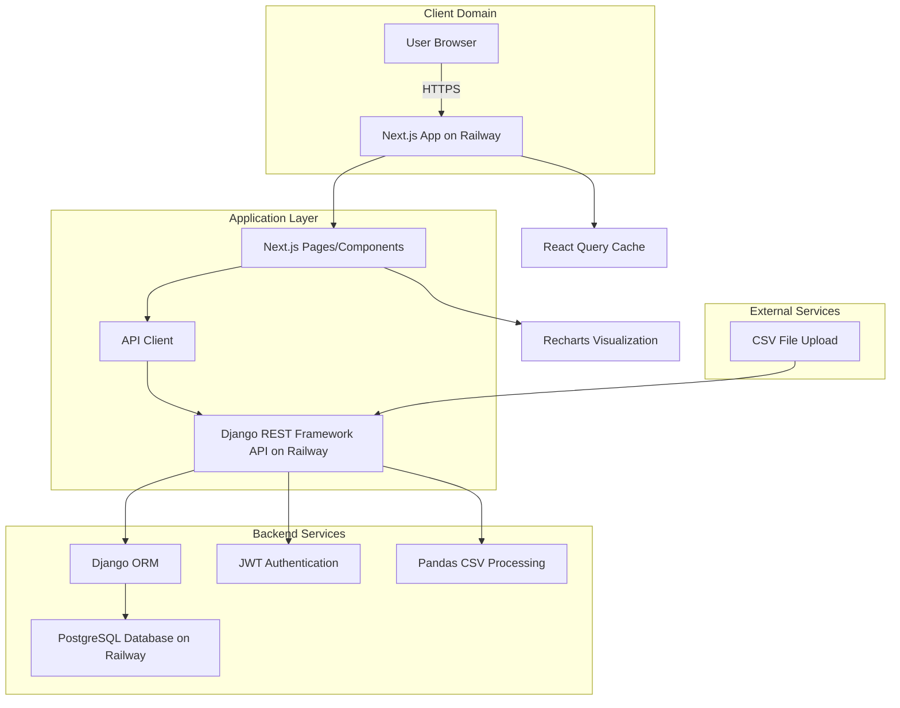

# 기술 명세서 (Technical Specification)

> 이 문서는 대학교 내부 데이터 시각화 대시보드 프로젝트의 기술 스택, 아키텍처, 그리고 주요 기술적 결정 사항을 정의합니다.
>
> **기반 문서:** `docs/requirement.md`, `docs/prd.md`

## 1. 개요 (Overview)

- **제품 목표:** Ecount 시스템에서 추출한 CSV 데이터를 기반으로, 주요 성과 지표(실적, 논문, 학생 수, 예산 등)를 직관적으로 파악할 수 있는 웹 대시보드를 구축하여, 데이터 기반 정보를 시각적으로 쉽고 편리하게 확인하여 신속하고 정확한 의사결정을 지원한다.
- **핵심 요구사항:**
  - IT 비전문가도 직관적으로 사용 가능한 UI/UX
  - 대시보드 데이터 조회 및 로딩 3초 이내 완료
  - 새로운 데이터 지표나 시각화 차트 유형을 쉽게 추가 가능한 확장성
  - 허가되지 않은 사용자의 접근 차단 (보안)

## 2. 기술 스택 (Technology Stack)

### 2.1. 프론트엔드 (Frontend)

- **Framework:** Next.js 14+ (App Router)
- **Language:** TypeScript
- **UI 라이브러리:** shadcn-ui (Radix UI 기반)
- **스타일링:** Tailwind CSS
- **상태 관리:**
  - **서버 상태:** TanStack React Query (v5)
  - **전역 상태:** Zustand
  - **폼 상태:** React Hook Form
- **데이터 시각화:** Recharts
- **유틸리티:**
  - `date-fns`: 날짜 처리
  - `zod`: 스키마 검증
  - `ts-pattern`: 타입 안전한 분기 처리
  - `es-toolkit`: 유틸리티 함수
  - `react-use`: React 커스텀 훅
  - `lucide-react`: 아이콘

**선택 이유:**
- **Next.js App Router:** 최신 Next.js 기능 활용, 서버 컴포넌트 지원, 파일 기반 라우팅의 직관성
- **TypeScript:** 정적 타입을 통해 코드의 안정성과 유지보수성 확보
- **shadcn-ui:** 접근성과 커스터마이징이 우수한 UI 컴포넌트, Tailwind CSS와 완벽 통합
- **Tailwind CSS:** 유틸리티 우선 CSS로 빠른 개발 및 일관된 디자인
- **React Query:** 서버 상태 관리, 캐싱, 자동 리페칭 등을 제공하여 개발 생산성 향상
- **Zustand:** 가볍고 직관적인 API, 최소한의 보일러플레이트로 상태 관리
- **Recharts:** React 기반의 선언적 차트 라이브러리, 다양한 차트 타입 지원

### 2.2. 백엔드 (Backend)

- **Framework:** Django REST Framework 3.14+
- **Language:** Python 3.11+
- **인증:**
  - JWT (JSON Web Token) - djangorestframework-simplejwt
  - Django 인증 시스템 (User 모델)
- **데이터 검증:** Django REST Framework Serializers
- **CSV 파싱:** Pandas
- **ORM:** Django ORM
- **웹 서버:** Gunicorn (프로덕션)

**선택 이유:**
- **Django REST Framework:** 강력한 인증 시스템과 ORM을 기반으로 안정적이고 보안이 검증된 API를 신속하게 개발할 수 있습니다. Serializer를 통한 자동 검증과 직렬화를 제공합니다.
- **Python & Pandas:** 데이터 처리 및 분석에 압도적인 생태계를 가지고 있어, 복잡한 CSV 데이터 파싱 및 정제 요구사항에 효과적으로 대응할 수 있습니다.
- **Django ORM:** 데이터베이스 쿼리를 추상화하여 SQL 직접 작성 없이도 안전하고 효율적인 데이터 접근이 가능합니다.
- **Gunicorn:** 프로덕션 환경에서 안정적이고 고성능의 WSGI 서버입니다.

### 2.3. 데이터베이스 (Database)

- **Type:** PostgreSQL
- **ORM:** Django ORM
- **마이그레이션:** Django Migrations
- **호스팅:** Railway (또는 자체 PostgreSQL 인스턴스)

**선택 이유:**
- **PostgreSQL:** 강력한 관계형 데이터베이스, 복잡한 집계 쿼리 지원
- **Django ORM:** Django와의 완벽한 통합, 타입 안전한 쿼리 작성, 자동 마이그레이션 관리
- **Railway:** PostgreSQL 서비스를 자동으로 프로비저닝하고 관리, 개발 생산성 향상

### 2.4. 인프라 및 배포 (Infrastructure & Deployment)

- **호스팅 플랫폼:** Railway.app
- **프론트엔드:** Next.js 서비스 (Railway)
- **백엔드:** Django REST Framework 서비스 (Railway)
- **데이터베이스:** PostgreSQL 서비스 (Railway)
- **CI/CD:** GitHub Actions (Railway 연동)
- **환경 변수 관리:** Railway Environment Variables

**선택 이유:**
- **Railway:** 프론트엔드와 백엔드를 별도 서비스로 배포하여 확장성과 유지보수성 향상
- **GitHub Actions:** 소스 코드 Push 시 자동 빌드 및 배포, 개발 워크플로우 간소화
- **통합 관리:** 모든 서비스를 하나의 플랫폼에서 관리하여 운영 부담 최소화

## 3. 고수준 아키텍처 (High-level Architecture)



### 3.1 아키텍처 설명

**클라이언트 레이어:**
- 사용자 브라우저에서 Next.js 앱에 접근
- React 컴포넌트가 UI 렌더링 및 사용자 상호작용 처리
- React Query가 서버 상태 관리 및 캐싱

**애플리케이션 레이어:**
- Next.js App Router 기반 페이지 라우팅
- API Client (`src/lib/remote/api-client.ts`)를 통해 Django 백엔드 API 호출
- Django REST Framework가 비즈니스 로직 및 데이터 처리 담당

**백엔드 서비스:**
- Django ORM을 통해 PostgreSQL 데이터베이스에 접근
- JWT 기반 인증으로 사용자 권한 관리 (djangorestframework-simplejwt)
- Pandas를 사용한 CSV 파일 파싱 및 검증 로직 실행

**데이터 레이어:**
- PostgreSQL (Railway)에 데이터 영구 저장
- React Query 캐시에 임시 데이터 저장 (성능 최적화)

## 4. 주요 기술적 결정 사항

### 4.1 분리된 아키텍처 선택
- **이유:** 프론트엔드와 백엔드를 별도 서비스로 분리하여 확장성과 유지보수성 향상
- **장점:**
  - 독립적인 배포 및 스케일링 가능
  - 기술 스택 선택의 유연성
  - 팀별 독립적인 개발 가능
- **구현:** Railway에서 프론트엔드와 백엔드를 별도 서비스로 배포

### 4.2 Django REST Framework 선택
- **이유:** 안정적이고 보안이 검증된 프레임워크, 풍부한 생태계
- **장점:**
  - 강력한 인증 시스템 (JWT 지원)
  - ORM을 통한 안전한 데이터베이스 접근
  - Serializer를 통한 자동 검증 및 직렬화
  - 관리자 페이지 제공 (개발/운영 편의성)
  - 검증된 보안 기능 (CSRF, XSS 방지 등)

### 4.3 PostgreSQL 선택
- **이유:** 강력한 관계형 데이터베이스, Django와의 완벽한 통합
- **장점:**
  - 복잡한 집계 쿼리 지원
  - 데이터 무결성 보장 (트랜잭션, 제약 조건)
  - Django ORM과의 완벽한 통합
  - Railway에서 자동 프로비저닝 및 관리

### 4.4 React Query 선택
- **이유:** 서버 상태 관리의 표준 솔루션
- **장점:**
  - 자동 캐싱 및 리페칭
  - 백그라운드 업데이트
  - 오류 처리 및 재시도 로직 내장
  - 개발자 경험 우수

## 5. 프로젝트 구조

```
Project-4-2/
├── src/                          # Next.js 프론트엔드
│   ├── app/                      # Next.js App Router
│   │   ├── (auth)/
│   │   │   └── login/
│   │   │       └── page.tsx
│   │   ├── (dashboard)/
│   │   │   ├── page.tsx          # 메인 대시보드
│   │   │   ├── dashboard/
│   │   │   │   ├── performance/
│   │   │   │   ├── papers/
│   │   │   │   ├── students/
│   │   │   │   └── budget/
│   │   │   └── admin/
│   │   │       └── upload/
│   ├── features/
│   │   ├── auth/
│   │   │   └── hooks/
│   │   │       └── useAuth.ts
│   │   ├── data/
│   │   │   └── hooks/
│   │   │       └── useUpload.ts
│   │   └── dashboard/
│   │       └── hooks/
│   │           └── useDashboard.ts
│   ├── components/
│   │   ├── ui/                   # shadcn-ui 컴포넌트
│   │   └── charts/               # 차트 컴포넌트
│   ├── lib/
│   │   ├── remote/
│   │   │   └── api-client.ts     # Django API 클라이언트
│   │   └── utils.ts              # 유틸리티 함수
│   └── hooks/                    # 공통 훅
└── backend/                      # Django REST Framework 백엔드
    ├── config/                   # Django 프로젝트 설정
    │   ├── settings.py
    │   ├── urls.py
    │   ├── wsgi.py
    │   └── asgi.py
    ├── apps/                     # Django 앱들
    │   ├── authentication/       # 인증 앱
    │   │   ├── models.py
    │   │   ├── serializers.py
    │   │   ├── views.py
    │   │   └── urls.py
    │   ├── data_upload/          # CSV 업로드 앱
    │   │   ├── models.py
    │   │   ├── serializers.py
    │   │   ├── views.py
    │   │   ├── services.py       # CSV 파싱 로직
    │   │   └── urls.py
    │   └── dashboard/           # 대시보드 API 앱
    │       ├── models.py
    │       ├── serializers.py
    │       ├── views.py
    │       └── urls.py
    ├── manage.py
    └── requirements.txt
```

## 6. 성능 최적화 전략

### 6.1 프론트엔드
- **React Query 캐싱:** 5분 `staleTime` 설정으로 불필요한 API 요청 최소화
- **코드 스플리팅:** Next.js 자동 코드 스플리팅 활용
- **이미지 최적화:** Next.js Image 컴포넌트 사용
- **번들 최적화:** Tree shaking 및 Dynamic Import 활용

### 6.2 백엔드
- **배치 삽입:** CSV 업로드 시 `bulk_insert` 사용
- **인덱스 최적화:** 자주 조회되는 컬럼에 인덱스 생성
- **쿼리 최적화:** 집계 쿼리는 서버 측에서 수행

### 6.3 데이터베이스
- **인덱스 전략:** Primary Key, Foreign Key, 자주 필터링되는 컬럼에 인덱스 생성
- **쿼리 최적화:** EXPLAIN ANALYZE로 쿼리 성능 분석

## 7. 보안 전략

### 7.1 인증
- **JWT 토큰:** Access Token (24시간 만료)
- **비밀번호 해싱:** bcrypt (salt rounds: 10)
- **토큰 저장:** HttpOnly Cookie 또는 LocalStorage (선택)

### 7.2 데이터 보안
- **입력 검증:** Django REST Framework Serializer로 모든 입력 검증
- **SQL Injection 방지:** Django ORM이 자동으로 파라미터화된 쿼리 사용
- **XSS 방지:** React의 자동 이스케이핑, Django 템플릿의 자동 이스케이핑

### 7.3 API 보안
- **CORS 설정:** 허용된 Origin만 접근 가능
- **Rate Limiting:** 향후 추가 고려
- **HTTPS:** Railway에서 자동 HTTPS 제공

## 8. 확장성 고려사항

### 8.1 수평 확장
- **Stateless API:** Django 애플리케이션이 상태를 가지지 않아 여러 인스턴스 실행 가능
- **Database Connection Pooling:** Django의 DB 커넥션 풀링 및 Railway PostgreSQL 연결 관리

### 8.2 기능 확장
- **Feature-based 구조:** 새로운 기능을 `backend/apps/` 디렉토리에 Django 앱으로 추가하기 쉬움
- **플러그인 시스템:** Django 미들웨어 및 DRF 뷰셋 시스템 활용
- **차트 라이브러리 교체:** Recharts를 다른 라이브러리로 쉽게 교체 가능 (인터페이스 추상화)

### 8.3 데이터 확장
- **마이그레이션 시스템:** Django Migrations으로 스키마 변경 관리
- **새로운 CSV 파일 추가:** 데이터 파싱 로직을 확장하여 새 파일 형식 지원 가능

---

**문서 버전:** 1.0  
**작성일:** 2025-01-XX  
**작성자:** spec-writer 에이전트  
**기반 문서:** `docs/requirement.md`, `docs/prd.md`
