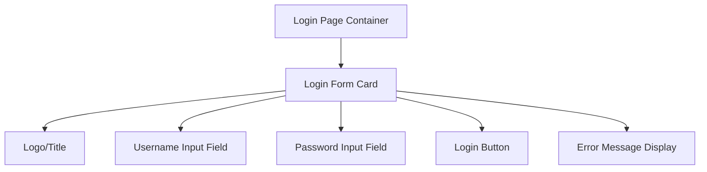
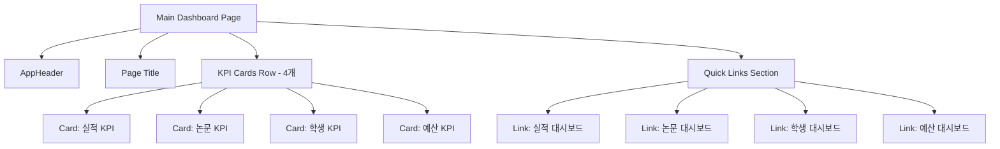
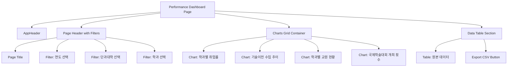
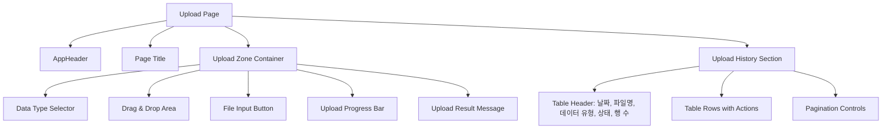

# UI 설계 명세서 (UI Design Specification)

> 이 문서는 `docs/userflow.md` 및 `docs/dataviz-spec.md`를 기반으로 각 페이지의 레이아웃, 컴포넌트 구조, 라우팅을 상세히 정의합니다.
>
> **기반 문서:** `docs/prd.md`, `docs/userflow.md`, `docs/dataviz-spec.md`

---

## 1. 라우팅 구조 (Routing Structure)

| 경로 (Path) | 페이지 이름 | 설명 | 접근 권한 |
|------------|-----------|------|----------|
| `/login` | 로그인 페이지 | 사용자 인증 | Public |
| `/` | 메인 대시보드 | 주요 지표 요약 카드 (4개) | Authenticated |
| `/dashboard/performance` | 실적 대시보드 | 학과별 성과 지표 시각화 | Authenticated |
| `/dashboard/papers` | 논문 대시보드 | 논문 게재 현황 시각화 | Authenticated |
| `/dashboard/students` | 학생 대시보드 | 학생 현황 시각화 | Authenticated |
| `/dashboard/budget` | 예산 대시보드 | 예산 집행 현황 시각화 | Authenticated |
| `/admin/upload` | 데이터 업로드 | CSV 파일 업로드 및 관리 | Authenticated, Admin Only |

---

## 2. 반응형 디자인 브레이크포인트 (Responsive Breakpoints)

| 디바이스 | 최소 너비 | 레이아웃 특성 |
|---------|---------|-------------|
| Mobile | 0px - 767px | 싱글 컬럼, 스택 레이아웃, 햄버거 메뉴 |
| Tablet | 768px - 1023px | 2컬럼 그리드 가능 |
| Desktop | 1024px 이상 | 멀티 컬럼 그리드, 전체 네비게이션 표시 |

---

## 3. 전역 네비게이션 (Global Navigation)

### 네비게이션 컴포넌트
- **위치:** 상단 고정 헤더 (Fixed Header, `sticky top-0`)
- **구성 요소:**
  - 로고/서비스명 (좌측): "대학교 데이터 대시보드"
  - 메인 메뉴 (중앙/우측):
    - 대시보드 (드롭다운: Overview, 실적, 논문, 학생, 예산)
    - 데이터 업로드 (관리자만 표시)
  - 사용자 메뉴 (우측):
    - 사용자 이름 표시
    - 로그아웃 버튼

### 모바일 네비게이션
- **햄버거 메뉴:** 768px 미만에서 표시
- **사이드 드로어:** 메뉴 클릭 시 좌측에서 슬라이드 인

---

## 4. 페이지별 상세 설계

### 4.1 로그인 페이지 (`/login`)

#### 페이지 목적
사용자가 아이디와 비밀번호를 입력하여 시스템에 접근할 수 있도록 함.

#### 와이어프레임 (Mermaid)



#### 컴포넌트 트리
```
LoginPage/
├── LoginContainer
│   ├── LoginCard
│   │   ├── Logo/Title
│   │   ├── LoginForm
│   │   │   ├── UsernameInput
│   │   │   ├── PasswordInput
│   │   │   ├── LoginButton
│   │   │   └── ErrorMessage
```

#### 상태 관리
- **Form State (React Hook Form):**
  - `username: string`
  - `password: string`
- **UI State:**
  - `isLoading: boolean`
  - `error: string | null`

#### 데이터 소스
- API Endpoint: `POST /api/auth/login`
- Request Body: `{ username, password }`
- Response: `{ success: true, data: { access_token, user } }`

#### 사용자 플로우
1. 사용자가 username과 password 입력
2. "로그인" 버튼 클릭
3. 로딩 인디케이터 표시
4. 성공 시: `/` (메인 대시보드)로 리디렉션
5. 실패 시: 에러 메시지 표시

#### 레이아웃
- **데스크톱:** 중앙 정렬 카드 (최대 너비 400px)
- **모바일:** 전체 너비 카드 (패딩 적용)

---

### 4.2 메인 대시보드 (`/`)

#### 페이지 목적
4개 주요 지표(실적, 논문, 학생, 예산)를 한눈에 파악하고, 각 지표의 상세 대시보드로 이동할 수 있도록 함.

#### 와이어프레임 (Mermaid)



#### 컴포넌트 트리
```
MainDashboardPage/
├── AppHeader (Global Navigation)
├── DashboardContainer
│   ├── PageHeader
│   │   └── PageTitle ("대시보드")
│   ├── KPICardsGrid (grid-cols-1 md:grid-cols-2 lg:grid-cols-4)
│   │   ├── KPICard (performance-kpi-card) [from dataviz-spec.md]
│   │   ├── KPICard (papers-kpi-card) [from dataviz-spec.md]
│   │   ├── KPICard (students-kpi-card) [from dataviz-spec.md]
│   │   └── KPICard (budget-kpi-card) [from dataviz-spec.md]
│   └── QuickLinksSection
│       ├── DashboardLink (performance)
│       ├── DashboardLink (papers)
│       ├── DashboardLink (students)
│       └── DashboardLink (budget)
```

#### 상태 관리
- **Data State (React Query):**
  - `overviewData: OverviewData | null`
  - `isLoading: boolean`
  - `error: string | null`

#### 데이터 소스
- API Endpoint: `GET /api/dashboard/overview`
- Response: `{ success: true, data: { performance, papers, students, budget } }`

#### 레이아웃
- **Desktop (1024px+):** 4컬럼 그리드 (KPI Cards)
- **Tablet (768px-1023px):** 2컬럼 그리드
- **Mobile (<768px):** 1컬럼 스택

---

### 4.3 실적 대시보드 (`/dashboard/performance`)

#### 페이지 목적
학과별 연도별 주요 성과 지표(취업률, 교원 수, 기술이전 수입액, 국제학술대회 개최 횟수)를 시각화하여 비교 및 평가를 지원합니다.

#### 와이어프레임 (Mermaid)



#### 컴포넌트 트리
```
PerformanceDashboardPage/
├── AppHeader (Global Navigation)
├── DashboardContainer
│   ├── PageHeader
│   │   ├── PageTitle ("실적 대시보드")
│   │   └── FilterSection
│   │       ├── YearFilter
│   │       ├── CollegeFilter
│   │       └── DepartmentFilter
│   ├── ChartsGrid (grid-cols-1 lg:grid-cols-2)
│   │   ├── ChartCard (department-employment-rates) [from dataviz-spec.md]
│   │   ├── ChartCard (tech-transfer-revenue-trend) [from dataviz-spec.md]
│   │   ├── ChartCard (faculty-status) [from dataviz-spec.md]
│   │   └── ChartCard (intl-conference-count) [from dataviz-spec.md]
│   └── DataTableSection
│       ├── DataTable
│       └── ExportButton
```

#### 상태 관리
- **Filter State:**
  - `evaluationYear: number | null`
  - `college: string | null`
  - `department: string | null`
- **Data State (React Query):**
  - `performanceData: PerformanceData | null`
  - `isLoading: boolean`
  - `error: string | null`

#### 데이터 소스
- API Endpoint: `GET /api/dashboard/performance?evaluation_year={year}&college={college}&department={department}`
- Response: `{ success: true, data: { employment_rates, tech_transfer_revenue, faculty_status, intl_conference_count } }`

#### 레이아웃
- **Desktop (1024px+):** 2x2 Grid (차트 4개)
- **Tablet (768px-1023px):** 1x2 또는 2x1 레이아웃
- **Mobile (<768px):** 1x1 레이아웃 (차트를 세로로 스택)

---

### 4.4 논문 대시보드 (`/dashboard/papers`)

#### 페이지 목적
학과별/저널등급별 논문 게재 현황을 시각화하여 연구 실적을 파악합니다.

#### 컴포넌트 트리
```
PapersDashboardPage/
├── AppHeader (Global Navigation)
├── DashboardContainer
│   ├── PageHeader
│   │   ├── PageTitle ("논문 대시보드")
│   │   └── FilterSection
│   │       ├── DateRangeFilter
│   │       ├── CollegeFilter
│   │       ├── DepartmentFilter
│   │       └── JournalGradeFilter
│   ├── ChartsGrid (grid-cols-1 lg:grid-cols-2)
│   │   ├── ChartCard (journal-grade-distribution) [from dataviz-spec.md]
│   │   ├── ChartCard (publication-by-department) [from dataviz-spec.md]
│   │   └── ChartCard (publication-trend) [from dataviz-spec.md]
│   └── DataTableSection
│       ├── DataTable
│       └── ExportButton
```

#### 상태 관리
- **Filter State:**
  - `startDate: Date | null`
  - `endDate: Date | null`
  - `college: string | null`
  - `department: string | null`
  - `journalGrade: string | null`
- **Data State (React Query):**
  - `papersData: PapersData | null`

#### 데이터 소스
- API Endpoint: `GET /api/dashboard/papers?start_date={start}&end_date={end}&college={college}&department={department}&journal_grade={grade}`

---

### 4.5 학생 대시보드 (`/dashboard/students`)

#### 페이지 목적
학과별/학년별/과정구분별 학생 수와 학적상태 통계를 시각화합니다.

#### 컴포넌트 트리
```
StudentsDashboardPage/
├── AppHeader (Global Navigation)
├── DashboardContainer
│   ├── PageHeader
│   │   ├── PageTitle ("학생 대시보드")
│   │   └── FilterSection
│   │       ├── CollegeFilter
│   │       ├── DepartmentFilter
│   │       ├── ProgramTypeFilter
│   │       └── AcademicStatusFilter
│   ├── ChartsGrid (grid-cols-1 lg:grid-cols-2)
│   │   ├── ChartCard (students-by-department) [from dataviz-spec.md]
│   │   ├── ChartCard (students-by-program) [from dataviz-spec.md]
│   │   └── ChartCard (academic-status-statistics) [from dataviz-spec.md]
│   └── DataTableSection
│       ├── DataTable
│       └── ExportButton
```

#### 데이터 소스
- API Endpoint: `GET /api/dashboard/students?college={college}&department={department}&program_type={type}&academic_status={status}`

---

### 4.6 예산 대시보드 (`/dashboard/budget`)

#### 페이지 목적
연구과제별 예산 집행 내역 및 집행률을 시각화하여 예산 관리 현황을 모니터링합니다.

#### 컴포넌트 트리
```
BudgetDashboardPage/
├── AppHeader (Global Navigation)
├── DashboardContainer
│   ├── PageHeader
│   │   ├── PageTitle ("예산 대시보드")
│   │   └── FilterSection
│   │       ├── DateRangeFilter
│   │       ├── DepartmentFilter
│   │       ├── FundingAgencyFilter
│   │       └── StatusFilter
│   ├── ChartsGrid (grid-cols-1 lg:grid-cols-2)
│   │   ├── ChartCard (research-budget-execution) [from dataviz-spec.md]
│   │   ├── ChartCard (funding-agency-distribution) [from dataviz-spec.md]
│   │   └── ChartCard (project-execution-rates) [from dataviz-spec.md]
│   └── DataTableSection
│       ├── DataTable
│       └── ExportButton
```

#### 데이터 소스
- API Endpoint: `GET /api/dashboard/budget?start_date={start}&end_date={end}&department={department}&funding_agency={agency}&status={status}`

---

### 4.7 데이터 업로드 페이지 (`/admin/upload`)

#### 페이지 목적
관리자가 CSV 파일을 업로드하고, 업로드 이력을 확인할 수 있도록 함.

#### 와이어프레임 (Mermaid)



#### 컴포넌트 트리
```
UploadPage/
├── AppHeader (Global Navigation)
├── UploadContainer
│   ├── PageHeader
│   │   └── PageTitle ("데이터 업로드")
│   ├── UploadZone
│   │   ├── DataTypeSelector (kpi/publication/project/student)
│   │   ├── DragDropArea
│   │   ├── FileInputButton
│   │   ├── UploadProgressBar
│   │   └── ResultMessage
│   └── UploadHistorySection
│       ├── UploadHistoryTable
│       │   ├── TableHeader
│       │   └── TableBody
│       │       └── HistoryRow (repeated)
│       └── PaginationControls
```

#### 상태 관리
- **Upload State:**
  - `dataType: 'kpi' | 'publication' | 'project' | 'student' | null`
  - `selectedFile: File | null`
  - `uploadProgress: number`
  - `uploadStatus: 'idle' | 'uploading' | 'success' | 'error'`
  - `uploadResult: UploadResult | null`
- **History State (React Query):**
  - `uploadHistory: UploadLog[]`
  - `pagination: { page: number, limit: number, total: number }`

#### 데이터 소스
- Upload API: `POST /api/data/upload` (multipart/form-data)
- History API: `GET /api/data/upload-logs?page={page}&limit={limit}&data_type={type}`
- Detail API: `GET /api/data/upload-logs/:id`

#### 사용자 플로우
1. 사용자가 데이터 유형 선택 (kpi/publication/project/student)
2. CSV 파일 선택 또는 드래그앤드롭
3. "업로드" 버튼 클릭
4. 업로드 진행률 표시
5. 업로드 완료 후 결과 메시지 및 이력 테이블 업데이트

---

## 5. 공통 컴포넌트 라이브러리

### 5.1 재사용 가능 컴포넌트 (shadcn-ui 기반)
- **Button:** 기본 버튼 (primary, secondary, danger variants)
- **Card:** 콘텐츠를 담는 카드 컨테이너
- **Input:** 텍스트 입력 필드 (text, password, email types)
- **Select:** 드롭다운 선택
- **Table:** 데이터 테이블
- **Dialog/Modal:** 모달 다이얼로그
- **Toast:** 알림 메시지
- **Skeleton:** 로딩 스켈레톤 UI
- **DatePicker:** 날짜 선택기

### 5.2 차트 컴포넌트 (Recharts 기반, from dataviz-spec.md)
- **LineChart:** 라인 차트 (예: 기술이전 수입 추이)
- **BarChart:** 막대 차트 (예: 학과별 취업률)
- **PieChart:** 파이 차트 (예: 저널 등급별 분포)
- **KPICard:** 단일 수치 KPI 표시 카드
- **ChartCard:** 차트를 감싸는 카드 래퍼 (제목, 필터, 차트 포함)

### 5.3 레이아웃 컴포넌트
- **AppHeader:** 전역 네비게이션 헤더
- **Sidebar:** 사이드바 네비게이션 (선택적)
- **Container:** 페이지 컨테이너 (최대 너비, 패딩)
- **Grid:** 반응형 그리드 레이아웃

---

## 6. 디자인 시스템

### 6.1 색상 팔레트 (Tailwind CSS)
- **Primary:** `#3B82F6` (Blue-500)
- **Secondary:** `#8B5CF6` (Violet-500)
- **Success:** `#10B981` (Emerald-500)
- **Warning:** `#F59E0B` (Amber-500)
- **Error:** `#EF4444` (Red-500)
- **Neutral:** `#6B7280` (Gray-500)
- **Background:** `#F9FAFB` (Gray-50)
- **Foreground:** `#111827` (Gray-900)

### 6.2 타이포그래피
- **Heading 1 (h1):** `text-3xl font-bold` (32px, Bold)
- **Heading 2 (h2):** `text-2xl font-semibold` (24px, SemiBold)
- **Heading 3 (h3):** `text-xl font-semibold` (20px, SemiBold)
- **Body:** `text-base` (16px, Regular)
- **Small:** `text-sm` (14px, Regular)
- **Caption:** `text-xs` (12px, Regular)

### 6.3 간격 (Spacing) - Tailwind CSS
- **xs:** `gap-1` (4px)
- **sm:** `gap-2` (8px)
- **md:** `gap-4` (16px)
- **lg:** `gap-6` (24px)
- **xl:** `gap-8` (32px)
- **2xl:** `gap-12` (48px)

### 6.4 그림자 (Shadows)
- **sm:** `shadow-sm`
- **md:** `shadow-md`
- **lg:** `shadow-lg`
- **xl:** `shadow-xl`

---

## 7. 접근성 (Accessibility)

### 7.1 키보드 네비게이션
- 모든 인터랙티브 요소는 키보드로 접근 가능해야 함 (Tab, Enter, Space)
- 포커스 인디케이터가 명확하게 표시되어야 함

### 7.2 스크린 리더 지원
- 폼 입력 필드는 명확한 `label`과 `aria-label`을 가져야 함
- 에러 메시지는 `aria-live="polite"`로 스크린 리더에 알림
- 버튼과 링크는 명확한 텍스트를 가져야 함

### 7.3 색상 대비
- 텍스트와 배경의 대비 비율은 최소 4.5:1 (WCAG AA 기준)
- 색상만으로 정보를 전달하지 않음 (아이콘/텍스트 병행)

### 7.4 반응형 이미지 및 미디어
- 이미지는 적절한 `alt` 텍스트를 가져야 함
- 미디어 쿼리를 사용하여 적절한 크기로 표시

---

## 8. 상태 관리 전략

### 8.1 전역 상태 (Zustand)
- **Auth Store:** 인증 상태, 사용자 정보
  ```typescript
  {
    user: User | null,
    isAuthenticated: boolean,
    login: (token: string, user: User) => void,
    logout: () => void
  }
  ```

### 8.2 서버 상태 (React Query)
- **캐싱 전략:**
  - `staleTime`: 5분 (대시보드 데이터)
  - `cacheTime`: 10분
  - `refetchOnWindowFocus`: true
- **모든 API 호출은 React Query를 통해 관리**

### 8.3 로컬 상태 (React State)
- 폼 상태: React Hook Form
- UI 상태: useState (모달 열림/닫힘, 필터 값 등)

---

## 9. 에러 처리

### 9.1 에러 표시 방법
- **폼 에러:** 입력 필드 하단에 빨간색 텍스트로 표시
- **API 에러:** Toast 알림 또는 페이지 상단 배너로 표시
- **전역 에러:** Error Boundary를 통한 대체 UI 표시

### 9.2 로딩 상태
- **데이터 로딩:** Skeleton UI 표시
- **버튼 로딩:** 버튼 내부에 스피너 표시 및 비활성화
- **전체 페이지 로딩:** 전체 스켈레톤 또는 스피너 표시

---

## 10. 구현 우선순위

### Phase 1 (MVP)
1. 로그인 페이지
2. 메인 대시보드 (4개 KPI 카드)
3. 실적 대시보드 (2-3개 주요 차트)
4. 기본 네비게이션
5. 데이터 업로드 페이지 (기본 기능)

### Phase 2
1. 나머지 대시보드 페이지 (논문, 학생, 예산)
2. 모든 차트 컴포넌트 구현
3. 업로드 이력 조회 기능
4. 필터링 기능

### Phase 3
1. 반응형 최적화 (모바일, 태블릿)
2. 접근성 개선
3. 애니메이션 및 인터랙션 개선
4. CSV 다운로드 기능

---

**문서 버전:** 1.0  
**작성일:** 2025-01-XX  
**작성자:** ui-designer 에이전트  
**기반 문서:** `docs/prd.md`, `docs/userflow.md`, `docs/dataviz-spec.md`
