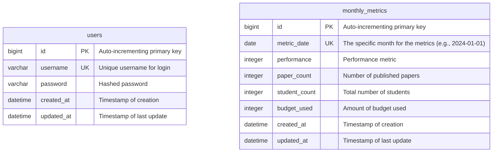

# 데이터베이스 스키마 (Database Schema)

> **중요:** 이 문서는 다음 문서들을 기반으로 작성됩니다:
> - `docs/dataflow.md`: 데이터 흐름 및 아키텍처
> - `docs/csv-sample.md`: 실제 CSV 파일 구조 명세 (필수 참조)
> - `docs/prd.md`: 제품 요구사항
>
> 특히 **`docs/csv-sample.md`**에 명시된 4개 CSV 파일(`department_kpi.csv`, `publication_list.csv`, `research_project_data.csv`, `student_roster.csv`)의 구조를 정확히 반영하여 데이터베이스 스키마를 설계해야 합니다.

## 1. ERD (Entity-Relationship Diagram)
> Mermaid.js 문법을 사용하여 전체 데이터베이스의 구조를 시각적으로 표현합니다.

## 2. 테이블 명세 (Table Specifications)

### 2.1. `users`
- **설명:** 시스템에 로그인할 수 있는 사용자(관리자) 계정 정보를 저장하는 테이블입니다.

| 컬럼명 (Column Name) | 데이터 타입 (Data Type) | 제약 조건 (Constraints) | 설명 (Description) |
|---|---|---|---|
| `id` | `BIGINT` | `PK`, `AUTO_INCREMENT` | 고유 식별자 |
| `username` | `VARCHAR(150)` | `NOT NULL`, `UNIQUE` | 로그인 시 사용할 아이디 |
| `password` | `VARCHAR(128)` | `NOT NULL` | 해시(Hash) 처리된 비밀번호 |
| `created_at` | `DATETIME` | `NOT NULL` | 생성 일시 |
| `updated_at` | `DATETIME` | `NOT NULL` | 마지막 수정 일시 |

### 2.2. `monthly_metrics`
- **설명:** 매월 Ecount에서 추출된 핵심 성과 지표 데이터를 저장하는 테이블입니다.

| 컬럼명 (Column Name) | 데이터 타입 (Data Type) | 제약 조건 (Constraints) | 설명 (Description) |
|---|---|---|---|
| `id` | `BIGINT` | `PK`, `AUTO_INCREMENT` | 고유 식별자 |
| `metric_date` | `DATE` | `NOT NULL`, `UNIQUE` | 지표의 기준 월 (매월 1일로 통일) |
| `performance` | `INTEGER` | `NOT NULL` | 실적 |
| `paper_count` | `INTEGER` | `NOT NULL` | 논문 게재 수 |
| `student_count` | `INTEGER` | `NOT NULL` | 총 학생 수 |
| `budget_used` | `INTEGER` | `NOT NULL` | 예산 사용액 |
| `created_at` | `DATETIME` | `NOT NULL` | 생성 일시 |
| `updated_at` | `DATETIME` | `NOT NULL` | 마지막 수정 일시 |

## 3. 인덱스 (Indexes)
- **`users.username`**: 로그인 시 사용자 검색 속도 향상을 위해 `username` 컬럼에 UNIQUE 인덱스를 생성합니다.
- **`monthly_metrics.metric_date`**: 기간별 데이터 조회 성능 향상을 위해 `metric_date` 컬럼에 UNIQUE 인덱스를 생성합니다.
