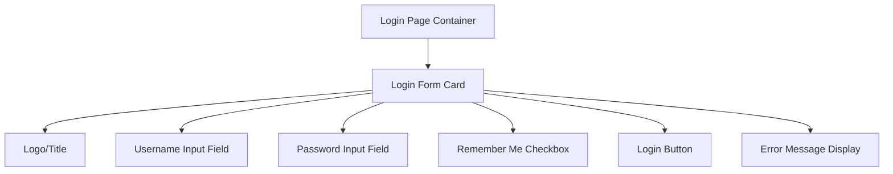
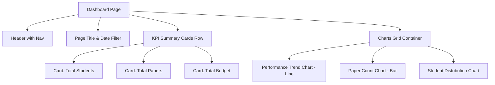
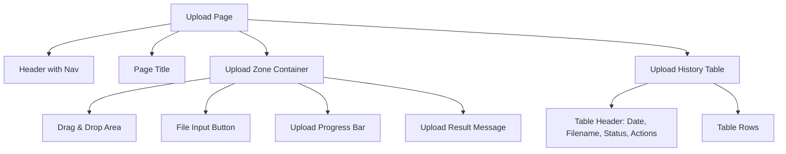

# UI 설계 명세서 (UI Design Specification)

> 이 문서는 `docs/userflow.md` 및 `docs/dataviz-spec.md`를 기반으로 각 페이지의 레이아웃, 컴포넌트 구조, 라우팅을 상세히 정의합니다.

---

## 1. 라우팅 구조 (Routing Structure)

| 경로 (Path) | 페이지 이름 | 설명 | 접근 권한 |
|------------|-----------|------|----------|
| `/login` | 로그인 페이지 | 사용자 인증 | Public |
| `/dashboard` | 대시보드 | 주요 지표 시각화 | Authenticated |
| `/upload` | 데이터 업로드 | 엑셀 파일 업로드 및 관리 | Authenticated |

---

## 2. 반응형 디자인 브레이크포인트 (Responsive Breakpoints)

| 디바이스 | 최소 너비 | 레이아웃 특성 |
|---------|---------|-------------|
| Mobile | 0px - 767px | 싱글 컬럼, 스택 레이아웃 |
| Tablet | 768px - 1023px | 2컬럼 그리드 가능 |
| Desktop | 1024px 이상 | 멀티 컬럼 그리드, 사이드바 네비게이션 |

---

## 3. 전역 네비게이션 (Global Navigation)

### 네비게이션 컴포넌트
- **위치:** 상단 고정 헤더 (Fixed Header)
- **구성 요소:**
  - 로고/서비스명 (좌측)
  - 메인 메뉴 (중앙/우측)
    - 대시보드
    - 데이터 업로드
  - 사용자 메뉴 (우측)
    - 프로필
    - 로그아웃

---

## 4. 페이지별 상세 설계

### 4.1 로그인 페이지 (`/login`)

#### 페이지 목적
사용자가 아이디와 비밀번호를 입력하여 시스템에 접근할 수 있도록 함.

#### 와이어프레임 (Mermaid)



#### 컴포넌트 트리
```
LoginPage/
├── LoginContainer
│   ├── LoginCard
│   │   ├── Logo
│   │   ├── LoginForm
│   │   │   ├── UsernameInput
│   │   │   ├── PasswordInput
│   │   │   ├── RememberMeCheckbox
│   │   │   ├── LoginButton
│   │   │   └── ErrorMessage
│   │   └── Footer (optional: links, version info)
```

#### 상태 관리
- **Form State:**
  - `username: string`
  - `password: string`
  - `rememberMe: boolean`
- **UI State:**
  - `isLoading: boolean`
  - `error: string | null`

#### 데이터 소스
- API Endpoint: `POST /api/auth/login`
- Request Body: `{ username, password }`
- Response: `{ token, user_info }`

#### 사용자 플로우
1. 사용자가 username과 password 입력
2. "로그인" 버튼 클릭
3. 로딩 인디케이터 표시
4. 성공 시: `/dashboard`로 리디렉션
5. 실패 시: 에러 메시지 표시

---

### 4.2 대시보드 페이지 (`/dashboard`)

#### 페이지 목적
주요 지표(실적, 논문, 학생 수, 예산 등)를 시각화하여 한눈에 파악할 수 있도록 함.

#### 와이어프레임 (Mermaid)



#### 컴포넌트 트리
```
DashboardPage/
├── AppHeader (Global Navigation)
├── DashboardContainer
│   ├── PageHeader
│   │   ├── PageTitle
│   │   └── DateRangePicker
│   ├── KPICardsRow
│   │   ├── KPICard (Total Students) [from dataviz-spec.md: total-students-kpi]
│   │   ├── KPICard (Total Papers)
│   │   └── KPICard (Total Budget)
│   ├── ChartsGrid
│   │   ├── ChartCard (Performance Trend) [from dataviz-spec.md: performance-trend-chart]
│   │   ├── ChartCard (Paper Count) [from dataviz-spec.md: paper-count-chart]
│   │   └── ChartCard (Student Distribution)
```

#### 상태 관리
- **Filter State:**
  - `dateRange: { start: Date, end: Date }`
- **Data State:**
  - `dashboardMetrics: DashboardMetrics | null`
  - `isLoading: boolean`
  - `error: string | null`

#### 데이터 소스
- API Endpoint: `GET /api/dashboard/metrics?start_date={start}&end_date={end}`
- Response:
  ```json
  {
    "performance_trend": [...],
    "paper_trend": [...],
    "student_summary": [...]
  }
  ```

#### 레이아웃 세부사항
- **Desktop (1024px+):**
  - KPI Cards: 3컬럼 그리드
  - Charts: 2컬럼 그리드
- **Tablet (768px-1023px):**
  - KPI Cards: 2컬럼 그리드
  - Charts: 1컬럼 스택
- **Mobile (<768px):**
  - 모든 요소: 1컬럼 스택

---

### 4.3 데이터 업로드 페이지 (`/upload`)

#### 페이지 목적
사용자가 엑셀 파일을 업로드하고, 업로드 이력을 확인할 수 있도록 함.

#### 와이어프레임 (Mermaid)



#### 컴포넌트 트리
```
UploadPage/
├── AppHeader (Global Navigation)
├── UploadContainer
│   ├── PageHeader
│   │   └── PageTitle
│   ├── UploadZone
│   │   ├── DragDropArea
│   │   ├── FileInputButton
│   │   ├── UploadProgressBar
│   │   └── ResultMessage
│   ├── UploadHistoryTable
│   │   ├── TableHeader
│   │   └── TableBody
│   │       └── HistoryRow (repeated)
```

#### 상태 관리
- **Upload State:**
  - `selectedFile: File | null`
  - `uploadProgress: number`
  - `uploadStatus: 'idle' | 'uploading' | 'success' | 'error'`
  - `uploadMessage: string | null`
- **History State:**
  - `uploadHistory: UploadRecord[]`
  - `isLoadingHistory: boolean`

#### 데이터 소스
- Upload API: `POST /api/upload/excel` (multipart/form-data)
- History API: `GET /api/upload/history`

---

## 5. 공통 컴포넌트 라이브러리

### 5.1 재사용 가능 컴포넌트
- **Button:** 기본 버튼 (primary, secondary, danger variants)
- **Card:** 콘텐츠를 담는 카드 컨테이너
- **Input:** 텍스트 입력 필드 (text, password, email types)
- **Select:** 드롭다운 선택
- **Table:** 데이터 테이블
- **Modal/Dialog:** 모달 다이얼로그
- **LoadingSpinner:** 로딩 인디케이터
- **ErrorMessage:** 에러 메시지 표시
- **DatePicker:** 날짜 선택기

### 5.2 차트 컴포넌트 (from dataviz-spec.md)
- **LineChart:** 라인 차트 (예: 월별 실적 추이)
- **BarChart:** 막대 차트 (예: 논문 게재 수)
- **KPICard:** 단일 수치 KPI 표시

---

## 6. 디자인 시스템

### 6.1 색상 팔레트
- **Primary:** #3B82F6 (Blue)
- **Secondary:** #8B5CF6 (Purple)
- **Success:** #10B981 (Green)
- **Warning:** #F59E0B (Orange)
- **Error:** #EF4444 (Red)
- **Neutral:** #6B7280 (Gray)

### 6.2 타이포그래피
- **Heading 1:** 32px, Bold
- **Heading 2:** 24px, SemiBold
- **Heading 3:** 20px, SemiBold
- **Body:** 16px, Regular
- **Small:** 14px, Regular

### 6.3 간격 (Spacing)
- **xs:** 4px
- **sm:** 8px
- **md:** 16px
- **lg:** 24px
- **xl:** 32px

---

## 7. 접근성 (Accessibility)

- 모든 인터랙티브 요소는 키보드로 접근 가능해야 함 (Tab, Enter)
- 폼 입력 필드는 명확한 label을 가져야 함
- 에러 메시지는 스크린 리더가 읽을 수 있어야 함 (aria-live)
- 색상만으로 정보를 전달하지 않음 (아이콘/텍스트 병행)
- 최소 대비 비율 4.5:1 준수 (WCAG AA 기준)

---

## 8. 구현 우선순위

1. **Phase 1 (MVP):**
   - 로그인 페이지
   - 대시보드 페이지 (KPI Cards + Performance Trend Chart)
   - 기본 네비게이션

2. **Phase 2:**
   - 데이터 업로드 페이지
   - 업로드 히스토리
   - 모든 차트 컴포넌트 구현

3. **Phase 3:**
   - 반응형 최적화
   - 접근성 개선
   - 애니메이션 및 인터랙션 polish
